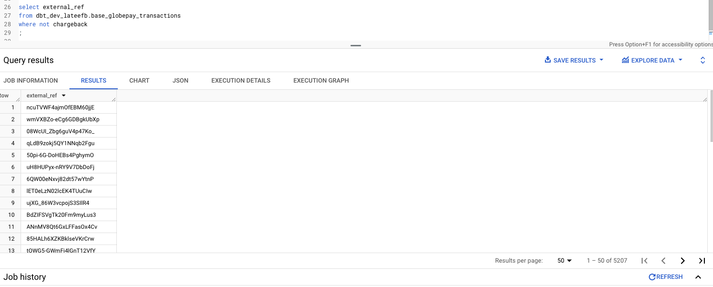

PLEASE NOTE: The following questions were answered using BigQuery SQL syntax.

## Part 1

### Preliminary data exploration

1. Uniqueness - Checked the source data to find the primary key column. This was the `external_ref` column in both source files. The chargeback data also includes a `ref` column (which is also unqiue and presumably internally generated).
2. Nulls - Checked that the primary key columns are not null and checked the columns useful for analytics. 
3. Date range - Checked the date range of the transactions and identified that it included daily transactions for a 6 month period, with each day having 30 transactions.
4. Referential integrity - Checked that all the values in `external_ref` in the chargeback report exist in the acceptance report for future joins.
5. Other tests
    - Checked distinct conbination of state and chargeback and identifued that all declined transactions did not include a chargeback.
    - Checked format for date_time, country and currency was consistent
    - Checked accepted values for boolean columns and columns that indicate low cardinality. 

### Summary of your model architecture
The model architecture consists of the following 4 layers:
1. Source layer - the source files were ingested unchanged into this layer. My implementation ingested them as seed files (production implementation would be ephemeral or view models).
2. Staging layer - this buillds on the seed files. Models were created as table models (time series data would be built as incremental model in production) including minor transformations such as filtering or table renaming.
3. Base (intermediate) layer - this is where multiple staging layers may interact and businessor domain specific rules and logic may be inroduced.
4. Analytics (mart) layer - this layer holds the final, business-facing models used for analyses and/or reporting.

### Lineage graph

The below is a lineage graph of my dbt project.


### Tips

##### Tests

dbt_utis and dbt_expectations are a good resource for testing models beyond the schema tests that exist in a standard dbt project. The tests included in my project include:
1. Unique - check primary key column is unique
2. Not null - checks column is not null
3. Relationship - Checks values in column exist in correspondning column in another model (useful for maintaining referential integrity).
4. Accepted values - Checks all values in a column exist in specified list.
5. Row count - Checks row count in one model matches row count in its upstream model (good indicator that no data is lost or duplicates have not been introduced).
6. Data test - created a custom test called `assert_usd_amount_equal_to_upstream_model` to check the total USD amount in model matches upstream model.

##### Documentation

Each seed/model includes its own yml file which includes a seed/model description as well as the level of granularity. A docs markdown file has been created including common column descriptions called `column_desriptions.md`. You can refer to the columns defined in the files when adding descriptions to objects in yml files. When the docs in the markdown files are changed, this will propagate to all of its reference throughout the project.

##### Macros

Macros can be used to create functions and templates for elements you intend to repeat throughout the project. This project includes a simple macro `extract_conversion_rate` which extracts the value (the currency rate) from a JSON dictionary when the key (currency code) is supplied. The default key is set to '$.USD'.


## Part 2

### What is the acceptance rate over time?

The above question may be answered using the `analytics_globepay_transactions`. The decision was made to group the metrics by month. The model may be easily amended to return the data at daily, weekly or annually. The following query is used to return the answer for the acceptance rate per month:

```
select 
      transaction_month, 
      sum(accepted_transactions) as accepted_transactions, 
      sum(total_transactions) as total_transactions, 
      round(sum(accepted_transactions)/ sum(total_transactions),2) as acceptance_rate
from {{ ref('analytics_globepay_transactions') }}
group by transaction_month
order by transaction_month
;
```

See results below.

```
transaction_month	accepted_transactions	total_transactions	acceptance_rate
2019-01-01 00:00:00.000000 UTC	647	930	0.7
2019-02-01 00:00:00.000000 UTC	589	840	0.7
2019-03-01 00:00:00.000000 UTC	641	930	0.69
2019-04-01 00:00:00.000000 UTC	610	900	0.68
2019-05-01 00:00:00.000000 UTC	645	930	0.69
2019-06-01 00:00:00.000000 UTC	645	900	0.72
```

### List the countries where the amount of declined transactions went over $25M

For this question, it was assumed that the results were only to be grouped by country and not to be filtered for a specific time period or any other attributes. 

The following query was used to return the results:

```
select 
      country,
      sum(declined_amount) as declined_amount
from {{ ref('analytics_globepay_transactions') }}
group by country
having declined_amount > 25000000
;
```

See results below.

```
country	declined_amount
CA	25583266.66
AE	26335152.43
US	25125669.78
```

### 3. Which transactions are missing chargeback data?

This section was tackled with multiple approaches due to my understanding of the question. See my approaches below. 

1. Which transaction IDs have a null chargeback? 

This can be answered using the following query. 

```
select external_ref
from {{ ref('base_globepay_transactions') }}
where chargeback is null
;
```

The above query returns 0 rows as all the transactions as all transactions have either a TRUE or FALSE value.

2. Which transaction IDs have false chargeback? 

This can be answered using the following query.

```
select external_ref
from {{ ref('base_globepay_transactions') }}
where not chargeback
;
```

This returned 5,207 rows of unique external_ref values. See image below.


3. How many transactions have null chargeback?

This can be answered using the following query.

```
select 
      sum(total_transactions) - sum(no_chargeback_count) - sum(chargeback_count)
from {{ ref('analytics_globepay_transactions') }}
;
```

This returned the value 0 which matches solution 1 as that also retuned no data.

4. How many transactions have false chargeback?

This can be answered using the following query.

```
select 
      sum(no_chargeback_count)
from {{ ref('analytics_globepay_transactions') }}
;
```

This returned the value 5207 which matches the number of rows in solution 2.
